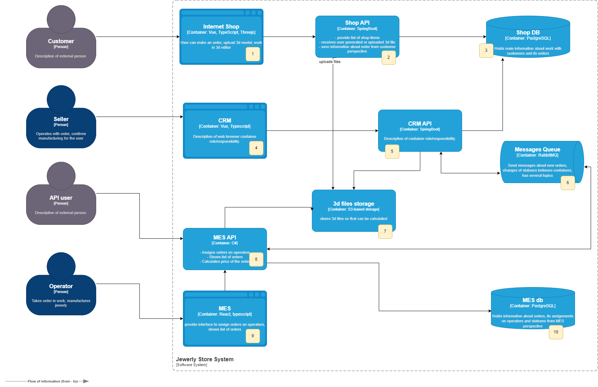
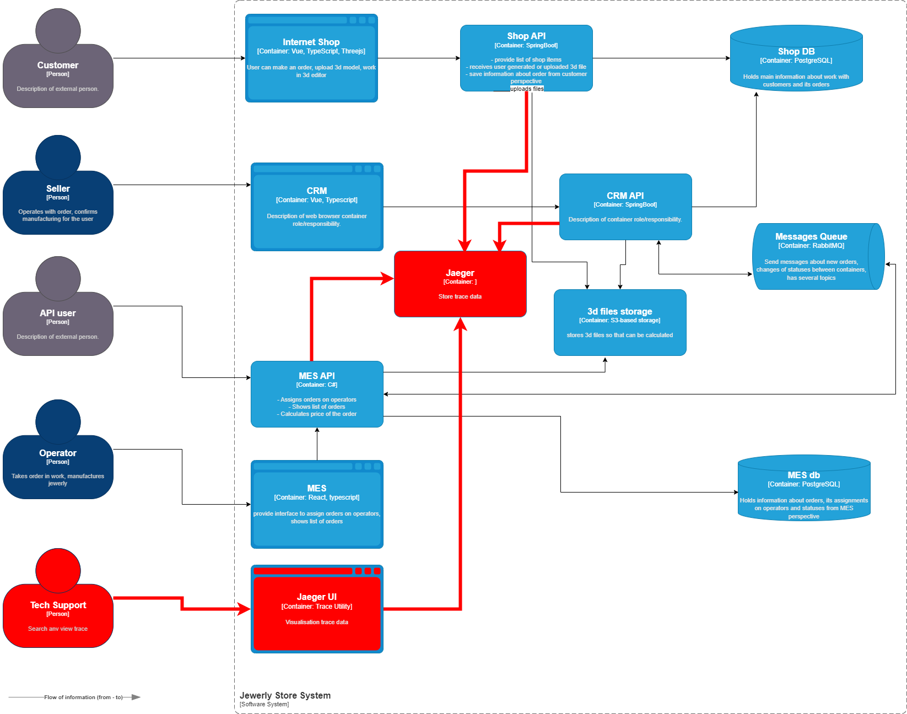

# Архитектурное решение по трейсингу

## Анализ узких мест
На схеме обозначены места возможных точек отказов

| Номер точки | Место           | Вероятные причины отказа                                                                                                                                              |
|-------------|-----------------|-----------------------------------------------------------------------------------------------------------------------------------------------------------------------|
| 1           | Internet Shop   | Ошибка на стороне клиента:  - "Протух" кэш и как следствие запрос устаревших данных,  - несогласованность контрактов, - ddos атака - отказ в обслуживании    |
| 2           | Shop API        | Ошибка API:  - Ошибки в работе контроллеров, - timeout'ы при работе с БД и хранилищем                                                                           |
| 3           | Shop DB         | Ошибка БД:  - "Забитые" пулы коннектов,  - падение БД,  - медленные запросы, - deadlock в транзакциях                                                     |
| 4           | CRM             | Ошибки на стороне клиента (аналогичны Internet Shop п1.)                                                                                                              |
| 5           | CRM API         | Ошибки API - аналогичны ошибкам Shop API + Неверные форматы сообщений, падение брокера сообщений                                                                      |
| 6           | Брокер RabbitMQ | - Некорректный формат сообщений  - Некорректный роутинг,  - timeout обработки                                                                                   |
| 7           | S3 Storage      | - Закончилось свободное место - Ограничение на длину файла - Ошибки в работе сервиса                                                                            |
| 8           | MES API         | - Падение сервисов пересчета в MES - Timeout на чтение файлов из хранилища - Timeout обработки сообщений от брокера - Некорректный формат входных сообщений |
| 9           | MES             | - Падение сервиса пересчета - Недостаточность ресурсов                                                                                                         |
| 10          | MES DB          | Проблемы аналогичны Shop DB                                                                                                                                           |

## Мотивация
Внедрение системы трейсинга позволит оперативно выявлять узкие и проблемные места все системы в целом.
Что позволит повысить надежность всей системы, сократить количество ошибок, что как следствие позволить сократить время планирования заказов и исключить "потерю" заказов.
Трейсинг позволит выявить систематичность возникновения проблем, что позволить найти и запланировать решение проблем с наиболее критичных и наиболее эффективным способом - оптимизировать не все подряд, а находить компромис между временем/дополнительными ресурсами и критичностью ошибок.
Количественно внедрение трейсинга повлияет на следующие бизнес-метрики:
1. Увеличение процента успешных заказов: в первую очередь за счет снижения количества "потерянных" заказов. Ожидаемо до 5%
2. Повышение загрузки производства: за счет передачи в производство "потерянных" заказов. Ориентировочно до 5%
3. Ускорение передачи заказов в производство: за счет оптимизации задержек по пути следования заказа до 10-20%
4. Повышение удовлетворенности клиентов: за счет снижения количества "потерянных" заказов, а также за счет повышения производительности интернет магазина.

Внедрение трейсинга ожидается в улучшении следующих технические метрик:
1. Снижение количества ошибок. Трейсинг позволит выявить места потери заказов и снизить количество таких ошибок до 15%
2. Сокращение времени решения инцидента - трейсинг позволяет оперативно выявлять как место ошибки, так и количественные величины задержек в бизнес-процессах.
3. Улучшение времени отклика - общая оптимизация должна привнести до 20% ускорения работы в критических интерфейсах.

В целом вложения во внедрение трейсинга позволит повысить стабильность системы, ее производительность и надежность. 
Ожидается предпринимаемые мероприятия приведут к улучшению пользовательского опыта и повышению лояльности клиентов и как следствие повышение прибыльности бизнеса
Кроме того внедрение трейсинга позволит в дальнейшем снизить риски модификации системы в случае расширения бизнеса.

## Предлагаемое решение

## Компромиссы
Трасссировка привносит элементы наблюдения над системой и позволяет осуществлять проактивное управление работой системыю.
Но все же могут быть причины, по которым трассировку не возможно внедрить, либо внедрить в полном объем, не только в техническом плане, но и по причине экономической нецелесообразности.
1. В системе могут присутствовать компоненты, сопровождаемые вендором - стоимость доработок чрезвычайно дорога (хотя и возможна).
2. В системе есть легаси компоненты, любая модификация которых связана с рисками потери работоспособности этих компонент и системы в целом.
3. Хранение данных трассировок может привести возрастанию объемов хранения и значительному удорожанию дисковой памяти.
4. Трейсинг может привести к некоторому снижению производительности.
5. В организации не достаточное количество специалистов для полноценного внедрения.

Варианты решения:
1. Поэтапное внедрение. Причем всегда надо начать с мониторинга, а трассировку внедрять постепенно по компонентам или по наиболее критическим бизнес-процессам (критическим как с точки зрения бизнеса, так и по времени исполнения)
2. Возможность включения/отключения трассировки только важным направлениям наблюдения.
3. Сокращение данных трассировки, только для снятия самых важных метрик

## Аспекты безопасности
1. Минимизация объемов хранения конфиденциальной информации (в идеале убрать или замаскировать любые конфиденциальные данные)
2. Доступ к данным трассировки ограничить только авторизованными сотрудниками технической поддержки.
3. Вынести средства трассировки и хранения данных трассировки в отдельный защищенный сегмент сети. 
4. По возможности использовать шифрование и передачу данных через защищенные протоколы (TLS/SSL) 