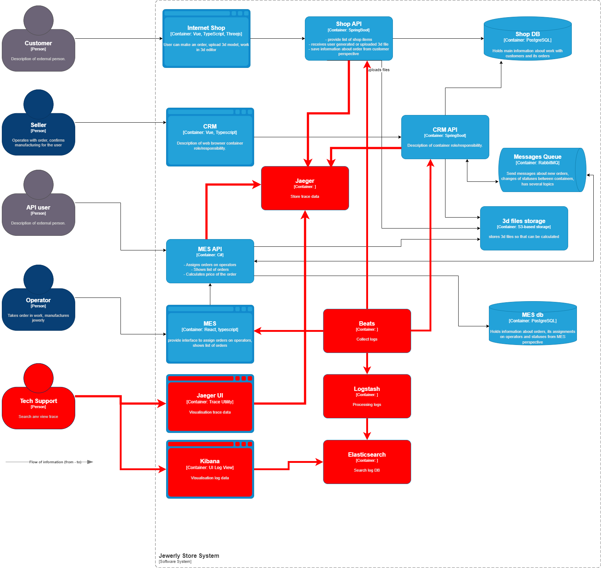

# Архитектурное решение по логированию
## Анализ системы на предмет логирования

При проектировании логирования необходимо обязательно предусмотреть работы по введению сквозного идентификатора RequestId в контексты процессов.
Допускается отсутствие RequestId только в начальных точках вызова процесса.

Во всех точках API где есть изменения состояния заказа логируется наименование сервиса, номера заказа и новое состояние

В производственной компоненте логируются все ключевые точки и места изменения состояния изменения заказа (такие как взят в работу, заказ выполнен, заказ упаковывается, заказа отправлен)

Любые ошибки обязательно должны логироваться в журналы.

Объекты логирования  

| Компонента    | Условие формирования                                                                              | Что логировать                                                                        | Уровень | Примечание                   |
|---------------|---------------------------------------------------------------------------------------------------|---------------------------------------------------------------------------------------|---------|------------------------------|
| Internet Shop | Обычный вызов страницы                                                                            | URL Страницы, IP вызова, USER UID, BODY запроса                                       | INFO    |                              |
|               | Недопустимый вызов (например без авторизации)                                                     | URL Страницы, IP вызова, USER UID пользователя, BODY запроса                          | ERROR   | Любые нарушения безопасности |
|               | Идентификация момента вызова Shop API                                                             | Параметры вызова API                                                                  | INFO    |                              |
|               | Регистрация момента предоставления ответа                                                         | Парамтеры ответа API                                                                  | INFO    |                              |
| Shop API      | Все вызовы API. Из логов должно быть понятно с какими параметрами вызывалось и что отдано в ответ | Ключевые параметры процесса залогированы в отдельные поля (OrderId, Status, USER UID) | INFO    |                              |
|               | Все ошибки API                                                                                    | Stack Trace места возникновения ошибки и текст ошибки                                 | ERROR   |                              |
|               | Сохранение данных в DB и в S3 хранилище                                                           | Параметры запросов, информация о файле (имя, размер, каталог хранения)                | INFO    |                              |
|               | Все ошибки исполнения запросов в DB и при сохранении в хранилище                                  | Stack Trace и текст ошибки                                                            | ERROR   |                              |
| CRM           | Все вызовы                                                                                        | Идентификатор страницы, IP вызова, Seller UID, Body запроса                           | INFO    |                              |
|               | Недопустимые вызовы                                                                               | Идентификатор страцины, IP вызова, Все доступные параметры для идентификации запроса  | ERROR   | Любые нарушения безопасности |
|               | Вызов CRM API                                                                                     | Параметры вызова API                                                                  | INFO    |                              |
|               | Ответ CRM API                                                                                     | Ответ API                                                                             | INFO    |                              |
| CRM API       | Вызов API                                                                                         | Параметры вызова                                                                      | INFO    |                              |
|               | Ошибки при работе API                                                                             | Stack Trace и текст ошибки, параметры процесса приведшего к ошибке                    | ERROR   |                              |
|               | Доступ к Shop DB, Отправка сообщения в Rabbit MQ, Взаимодействие с S3 хранилищем                  | Все параметры, тело сообщения, контекст процесса                                      | INFO    |                              |
| MES API       | Вызов API                                                                                         | Все параметры вызова API                                                              | INFO    |                              |
|               | Ошибки API                                                                                        | Stack trace и текст ошибки                                                            | ERROR   |                              |
|               | Ответ API                                                                                         | Ответ API                                                                             | INFO    |                              |
| MES           | Взаимодействие с оператором                                                                       | Параметры вызова                                                                      | INFO    |                              |
|               | Ошибки                                                                                            | Stack trace и текст ошибки                                                            | ERROR   |                              |                                                                                      |         |                              |

*В каждом логе должно обязательно присутствовать время и сквозной идентификатор RequestId (если он заполняется)

**RequestId - должен быть добавлен во все цепочки вызовов. При необходимости добавляется к контексту процесса (в http и rabbitMq в заголовки)

При необходимости более детальной проработки производства допускается ведение более подробных журналов (в продуктивном окружении включать уровни ниже INFO допускается только на короткое время)

## Мотивация
В связи с увеличивающейся интенсивностью производственных процессов требуется внедрение расширенных средств для наблюдения за состоянием системы.
Это необходимо в первую очередь для поддержания стабильности и надежности производственных процессов. 
Логирование и трейсинг позволяют все сторонне наблюдать за системой, а в случае возникновения ошибок оперативно локализовывать место ошибки.
Влияние логирования на ключевые метрики:
1. Сокращает время решения инцидентов (MTTR - Mean Time To Resolution). Ожидается сокращение на 15-30%
2. Уменьшение количества ошибок (Error Rate). Ожидается снижение на 5-10%
3. Повышение безопасности. Онлайн наблюдение за подозрительными активностями позволит оперативно предотвращать инциденты безопасности
4. Ведение журналов позволяет видеть детальную картину как системы в целом, так и в разрезе отдельно взятых процессов, что даст фактуру для улучшения и оптимизации работы системы в целом.

В первую очередь необходимо добавить логирование в API - Shop API, CRM API, MES API. Эти точки запуска и изменения состояния большинства процессов в системе и это позволит в максимально короткие сроки повысить качество наблюдения за системой.
При этом обязательно залогировать надо места взаимодействия с RabbitMQ, СУБД и S3 Хранилища, а также результаты совершения операций.
Во вторую очередь добавляются входные точки старта процессов, которые позволят охватить полностью наблюдение за системой.
 

## Предлагаемое решение
Предлагается внедрить систему на базе стека ELK - Elasticsearch, Logstash, Kibana.
Система хорошо масштабируется, а также из коробки интегрирурется с системой трассировки Jaeger

Технологии и компоненты:
1. Elasticsearch: Timeseries БД для хранения логов. Обеспечивает быстрый поиск и анализ больших объемов данных
2. Logstash: Компонент для сбора логов. Парсит неструктурированные логи, фильтрует, добавляет метаданные.
3. Kibana: UI для просмотра и анализа логов. Позволяет создавать дашборды, проводить анализ и отображать графики
4. Beats (Filebeat): Легковесный агент для сбора логов. Служит для предварительной обработки и отправки в logstash

### Политика хранения логов. 
1. Утвердить политику хранения логов на основе нормативных требований и потребностей бизнеса. Рекомендуемый срок хранения: 30 дней для оперативного анализа и сверки с контрагентами.
2. Старые логи архивировать в более дешевые хранилища.

## Создание системы анализы логов
1. Настроить систему уведомлений (алертинга) на выход за критические параметры обработки
   Например:
   - Не санкционированный доступ к ресурсам
   - Недоступность системы в течение некоторого периода
   - Падение SLA обработки сообщений
   - Новые сообщения в очереди DLQ
   - Появление критических ошибок
   и т.п.
2. Настроить dashboards для получения быстрых запросов к ошибкам и критическим ситуациям

### Добавление обнаружения аномалий
1. DDoS атаки: Количество запросов превысило на 100% максимальный показатель запросов к API. Уведомление в канал безопасности
2. Время исполнения заказа превысило на 50% максимально зафиксированное время исполнения заказа. Уведомление в канал техподдержки.
3. Время передачи заказа в производство превысило 3 дня. Уведомление в канал продаж.